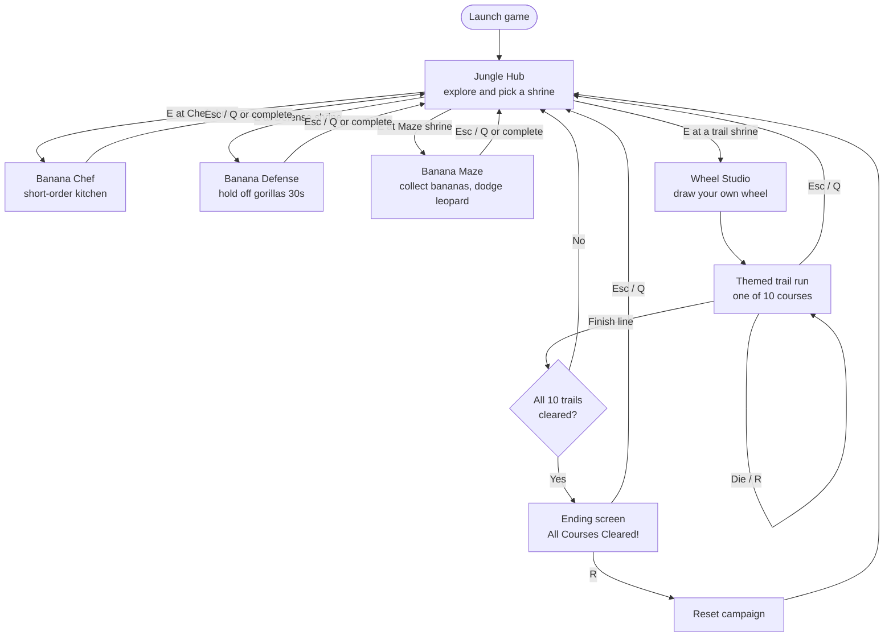
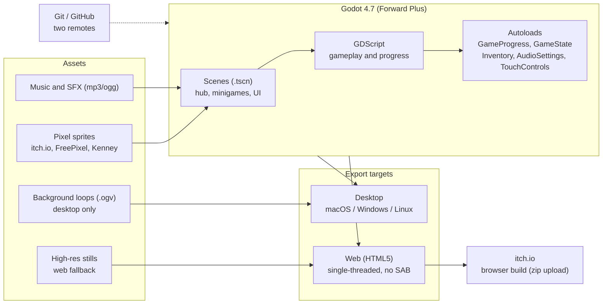

# BABOOM - Banana Genesis Mini-Games

A comedy monkey-civilization jam game built in **Godot 4.7**. Explore a jungle hub, enter shrines, invent wheels, cook bananas, defend your stash, and outrun a leopard in the maze.

**Repos:** [BananaGenesisGameJam2026](https://github.com/isaksmith/BananaGenesisGameJam2026)
**Original:** [GameJam2026](https://github.com/isaksmith/GameJam2026)

## Run

1. Install [Godot 4.7+](https://godotengine.org/download) (Forward Plus).
2. Open this folder as a project (`project.godot`).
3. Press **F5** / Play - main scene is `scenes/main.tscn`.

```bash
godot --path .
```

If Godot fails with missing class names (`WheelLevels`, `GameAudio`, etc.), regenerate the import cache once:

```bash
godot --path . --import
```

## Controls

| Action | Keys | Touch (mobile / phone browser) |
|--------|------|--------------------------------|
| Move | `WASD` / Arrow keys | Left virtual stick |
| Jump | `Space` | **JUMP** (wheel trails) |
| Interact / Enter shrine | `E` | **E** |
| Exit minigame | `Esc` / `Q` | **EXIT** |
| Restart trail | `R` | **R** |
| Recipe book | `C` | **BOOK** / tap `[C] Recipe Book` |

On-screen controls appear automatically on touchscreens (and after the first finger tap on mobile web). Desktop keyboard/mouse is unchanged. Local testing: `godot --path . -- --touch-controls`.

## Modes

From the **home hub**, walk to a shrine and press **E**.

### Side minigames

| Shrine | Mode | Goal |
|--------|------|------|
| **Banana Chef** | Short-order kitchen | Prep, blend, and serve banana dishes from the recipe book |
| **Banana Defense** | Stash defense | Protect bananas from gorilla thieves for 30s (or clear them early) |
| **Banana Maze** | Top-down maze | Collect every banana while a leopard hunts you (3 lives) |

### Wheel Trails

Draw a steering wheel in the studio, then ride a themed course in a banana cart. Wheel size and roundness change jump, grip, and what you can clear. Clear all **10** trails to unlock the ending screen.

| Trail | Theme | Twist |
|-------|-------|-------|
| **Gap Gorge** | Forest | Jump pads and wide chasms - big wheels clear the leaps |
| **Needle Pass** | Forest | Spike tunnels and saws - tiny wheels fit the ship-lane |
| **Wobble Ridge** | Forest | Moving platforms and chaos - round wheels hold the line |
| **Sprint Delta** | Forest | Fast scroll with tight spike rhythm - compact wheels keep up |
| **Frost Fjord** | Winter / ice | Slippery ice, pads, and frozen saws - round medium wheels grip |
| **Moon Graveyard** | Graveyard | Stone tombs under a full moon - medium wheels clear the crypt lanes |
| **Desert Sky** | Desert dunes | Wide gaps and tumbleweeds that roll off ledges into pits |
| **Lunar Void** | Moonscape | Low-gravity hops between crater lanes - stay compact |
| **Tiger Trail** | Jungle | A tiger slowly hunts you - keep rolling or get mauled |
| **Mushroom Grove** | Mushroom forest | Hopping magic shrooms - bump one for a rainbow trip overlay |

## Game flow



## Technology stack



## Project layout

```
scenes/          Hub, minigames, UI
scripts/         Gameplay logic
assets/sprites/  Characters, platforms, shrine art, web background stills
assets/audio/    Hub + trail music, SFX
assets/video/    Hub / defense / maze background loops (desktop)
assets/credits/  Third-party asset credits
builds/web/      HTML5 export output
```

## Credits

Third-party itch.io / FreePixel / Kenney assets are listed in [`assets/credits/ITCH_CREDITS.md`](assets/credits/ITCH_CREDITS.md). Please support those creators if you can.

## Play online (itch.io)

A browser build is exported with Godot's **Web** preset (single-threaded; no SharedArrayBuffer required):

1. In Godot: **Project → Export → Web → Export Project**  
   (preset is saved in `export_presets.cfg`; output goes to `builds/web/`).
2. Zip the **contents** of `builds/web/` so `index.html` is at the zip root  
   (also produced as `builds/banana-genesis-web.zip` / Desktop copy).
3. On [itch.io](https://itch.io/game/new): create a project → **Kind: HTML** → upload the zip → enable **This file will be played in the browser**.
4. Viewport size: **1280 × 720** (stretch mode expands for phone aspect ratios). Pricing: **No payments / free**.
5. Mobile browsers get a virtual stick + action buttons; landscape is recommended.

### Web vs desktop backgrounds

Godot's Theora `VideoStreamPlayer` is unreliable in the HTML5 export and can freeze or crash the tab. The web build therefore uses high-resolution stills captured from the same background videos (`*_background_still.png` / `hub_background_still.png`). Desktop keeps the looping `.ogv` backgrounds.

Video files (`*.ogv`, `*.mp4`, `*.webm`) are excluded from the web pack via `export_presets.cfg`.

## License

Jam project - see asset credit files for third-party terms. Game code is provided for the jam unless otherwise noted.
